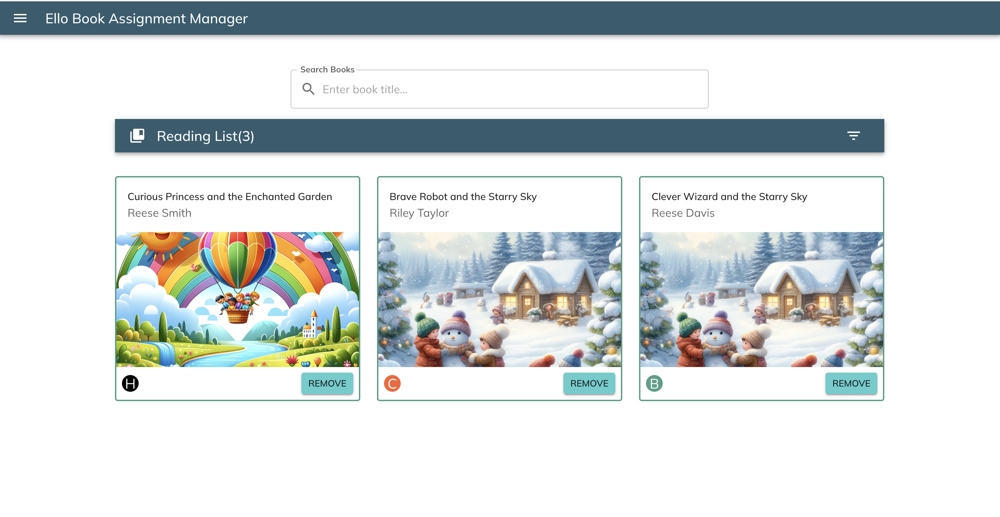

# Ello Book Assignment Manager

## Description

The Ello Book Assignment Manager is a React application that allows users to search for books by title, add them to a reading list, and manage the reading list effectively. The app leverages Material-UI for the UI components and integrates with a GraphQL server to fetch book data.

## Features

- **Search Bar**: Allows users to search for books by title. The search results are dynamically filtered as the user types.
- **Search Results**: Displays book title, author, and a button to add the book to the reading list. Each book result includes an image, title, and author.
- **Reading List**: Displays a list of books that have been added by the user. Users can also remove books from the reading list.
- **Responsive UI**: The UI components are styled using Material-UI and are fully responsive.

## Setup and Installation

### Prerequisites

- Node.js and npm installed on your machine.

### Backend

1. Navigate to the `ello-book-assignment-manager/backend` directory:
    ```bash
    cd ello-book-assignment-manager/backend
    ```
2. Install the dependencies:
    ```bash
    npm install
    ```
3. Start the GraphQL server:
    ```bash
    npm start
    ```
   This will start a GraphQL server at `http://localhost:4000/`.

### Frontend

1. Navigate to the `ello-book-assignment-manager/frontend` directory:
    ```bash
    cd ello-book-assignment-manager/frontend
    ```
2. Install the dependencies:
    ```bash
    npm install
    ```
3. Start the React application:
    ```bash
    npm start
    ```
   This will start the frontend application at `http://localhost:3000/`.

## Usage

1. **Search for Books**: Use the search bar at the top of the page to search for books by their title.
2. **Add Books to Reading List**: Click the "Add" button next to a book in the search results to add it to your reading list.
3. **Manage Reading List**: View the reading list at the bottom of the page. Click the "Remove" button to remove a book from the list.

## Screenshots



## Technologies Used

- **React**: JavaScript library for building user interfaces.
- **TypeScript**: Typed superset of JavaScript that compiles to plain JavaScript.
- **Material-UI**: React components for faster and easier web development.
- **GraphQL**: Query language for your API.
- **Apollo Client**: Comprehensive state management library for JavaScript that enables you to manage both local and remote data with GraphQL.

## Folder Structure
```bash
.DS_Store
backend
   |-- .eslintrc.json
   |-- .gitignore
   |-- package.json
   |-- src
   |   |-- app.ts
   |   |-- data
   |   |   |-- books.ts
   |   |-- resolvers
   |   |   |-- index.ts
   |   |-- schema
   |   |   |-- index.ts
   |-- tsconfig.json
frontend
   |-- .gitignore
   |-- README.md
   |-- package.json
   |-- public
   |   |-- assets
   |   |   |-- image1.webp
   |   |   |-- image10.webp
   |   |   |-- image2.webp
   |   |   |-- image3.webp
   |   |   |-- image4.webp
   |   |   |-- image5.webp
   |   |   |-- image6.webp
   |   |   |-- image7.webp
   |   |   |-- image8.webp
   |   |   |-- image9.webp
   |   |-- index.html
   |   |-- manifest.json
   |   |-- robots.txt
   |-- src
   |   |-- App.css
   |   |-- App.test.tsx
   |   |-- App.tsx
   |   |-- components
   |   |   |-- BookItem
   |   |   |   |-- BookItem.tsx
   |   |   |   |-- index.ts
   |   |   |   |-- types.ts
   |   |   |-- NavBar
   |   |   |   |-- NavBar.tsx
   |   |   |   |-- SecondaryNavBar.tsx
   |   |   |   |-- index.ts
   |   |   |   |-- types.ts
   |   |   |-- NotFound
   |   |   |   |-- NotFoundReadingList.tsx
   |   |   |   |-- NotFoundSearchResults.tsx
   |   |   |   |-- index.ts
   |   |   |-- ReadingList
   |   |   |   |-- ReadingList.tsx
   |   |   |   |-- index.ts
   |   |   |   |-- types.ts
   |   |   |-- SearchBar
   |   |   |   |-- SearchBar.css
   |   |   |   |-- SearchBar.tsx
   |   |   |   |-- index.ts
   |   |   |   |-- types.ts
   |   |   |-- SearchInput
   |   |   |   |-- SearchInput.tsx
   |   |   |   |-- index.ts
   |   |   |   |-- types.ts
   |   |   |-- SearchItemComponent
   |   |   |   |-- SearchItemComponent.tsx
   |   |   |   |-- index.ts
   |   |   |   |-- types.ts
   |   |   |-- index.ts
   |   |-- hooks
   |   |   |-- index.ts
   |   |   |-- useAdjustedBooks.ts
   |   |   |-- useAvatarColor.ts
   |   |-- index.css
   |   |-- index.tsx
   |   |-- react-app-env.d.ts
   |   |-- setupTests.ts
   |   |-- theme
   |   |   |-- index.ts
   |   |   |-- theme.ts
   |   |-- types.ts
   |   |-- utils
   |   |   |-- client.ts
   |-- tsconfig.json
```

## Contributing

Contributions are welcome! Please create a pull request with your changes.

## License

This project is licensed under the MIT License.

## Contact

For any inquiries, please contact Samuel Kinuthia at skinuthia77@gmail.com.